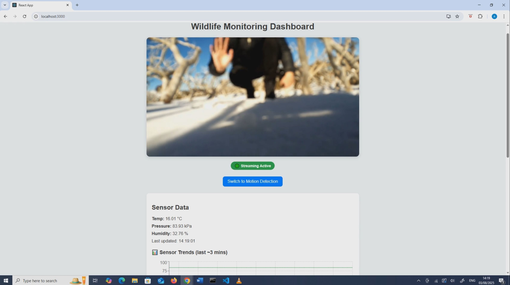
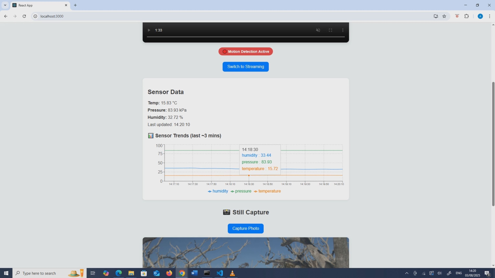
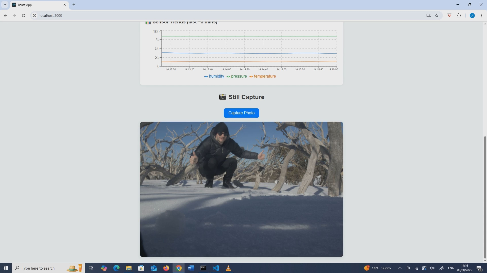

# Wildlife Camera System

[](https://github.com/Adrian-Amoddio/wildlife-detection-camera-system/stargazers)

I designed and built a fully off grid, solar powered wildlife monitoring system. It can stream live video, log environmental data, and trigger my Canon EOS R6 for high-resolution stills remotely from anywhere with mobile reception.

The system operates with a Raspberry Pi 5, Python/Flask backend, a React dashboard for camera / mode control and monitoring, and an AWS EC2 instance for streaming with a dockerized NGINX server with RTMP to HLS conversion. I created everything myself and handled: picking the hardware, designing and fabricating the case, electronics wiring, networking, coding the APIs, and coding the front end website.

The goal was to create a drop and leave anywhere device for photographing and researching wildlife in places that are hard to reach without having to hike back in to retrieve data or pickup heavy gear.

Tech Summary: Raspberry Pi 5, Python, Flask, React, AWS EC2, Docker, NGINX RTMP/HLS, I²C sensor integration, Linux, CAD, Hands on Fabrication

---

## Demo

[](https://youtu.be/tZjDdPRHNxE)  
[▶ **Watch on YouTube**](https://youtu.be/tZjDdPRHNxE)

---

## Tech Stack

- **Hardware:** Raspberry Pi 5 (8GB), Pi Camera Module 3 Wide, Canon EOS R6 , PicoDev BMP280 sensor
- **Pi software:** Python 3.11, `libcamera`, `ffmpeg`, `gphoto2`
- **Backend (EC2):** Dockerized NGINX RTMP/HLS streaming server, Flask API for recieving sensor data
- **Frontend:** React with Recharts, live video stream, environmental telemetry, Canon R6 capture, able to toggle modes
- **Protocols:** RTMP to HLS, REST (JSON), I²C
- **Power and Enclosure:** LiFePO₄ battery, solar panel, custom lens port and weather proof case

---

## 

### Final UI Screenshots





## 

---

## What it does

- **Live stream**: Low-latency HLS stream from the Pi → EC2 → React front end
- **Motion detection**: Triggers the R6 for high-resolution stills (or you can capture manually).
- **Telemetry**: Temperature, pressure, humidity via BMP280 with charts where you can view the data.
- **Mode switching**: Toggle **Motion** ↔ **Streaming** from the dashboard.
- **Smart and Reliable UX**: Sensor polling, stream retry logic, and clear error states in the UI.

> **My role:** I designed and implemented the **entire system**—hardware choices, enclosure, Pi scripts, EC2 services, and the React frontend.

---

## Project Structure

```
├── captures/                     # Optional saved test images or videos
│
├── docs/                          # Build images and final deployed photograph
│   ├── Pi-Wildlife-Detection-System-Wiring-Diagram.JPG
│   └── build-images/
│       ├── 1.jpg … 40.jpg
│       ├── AlFlange.JPG
│       └── Deployed.JPG
│
├── ec2-server/                    # Backend scripts and dockerfile for video stream and sensor data
│   ├── environmental_sensor/      # Flask API for sending BMP280 sensor data to the EC2 server
│   │   ├── app.py
│   │   ├── Dockerfile.txt
│   │   └── requirements.txt
│   │
│   └── nginx-rtmp/                 # RTMP/HLS server
│       ├── docker-compose.yml
│       ├── nginx.conf
│       └── nginx-hls/              # RTMP to HLS Docker build for NGINX
│
├── frontend/                      # Front End React Website
│   └── react-frontend/
│       ├── player.html
│       ├── styles.css
│       └── pi-stream-ui/
│           ├── .env.example
│           ├── package.json
│           ├── public/
│           └── src/
│
├── hardware/                      # CAD/drawings for custom lens port for Canon R6
│   ├── acrylic-flange-files/
│   ├── aluminium-flange-files/
│   └── pmma-flange-files/
│
└── pi/                            # All scripts that run on the Pi for the different functions of the device
    ├── capture_api.py              # Remote still photo capture with the Canon EOS R6
    ├── motion_trigger_picamera2.py # Motion detection script that triggers the R6
    ├── send_sensor_data.py         # Sends sensor data to the EC2 backend
    ├── start_stream.sh             # Used whenever the user switches into streaming mode. Cannot run when other scripts are accessing the pi camera 3 wide
    └── requirements.txt
```

---

## Hardware

- Raspberry Pi 5 8GB
- Pi Camera Module 3 Wide
- Canon EOS R6 with 24–70mm f2.8 RF lens
- Picodev BMP280 environmental sensor
- D-Link Cat6 Mobile Hotspot
- Kings 12V LiFePO4 battery
- Kings 200W Solar Panel
- Kings Anderson Solar Extension Cable
- Dune MPPT Solar Charge Controller
- Tactix Black Extra Large Tough Case
- Custom camera lens port (see `/hardware/`)
- 2 × 6mm Waterproof cable glands

---

## Software

- Raspberry Pi OS (Bookworm or later, 64-bit)
- Python 3.11+
- `libcamera`
- `gphoto2`
- `ffmpeg`
- AWS EC2 backend (NGINX RTMP/HLS + Flask API)

---

## Installation

1. **Clone this repository** onto your Pi 5:

   ```bash
   git clone https://github.com/Adrian-Amoddio/wildlife-detection-camera-system.git
   cd wildlife-detection-camera-system/pi
   ```

2. **Install Python dependencies**:

   ```bash
   python3 -m venv venv
   source venv/bin/activate
   pip install -r requirements.txt
   ```

3. **Install system dependencies**:

   ```bash
   sudo apt update
   sudo apt install ffmpeg gphoto2 python3-pip libatlas-base-dev
   ```

4. **Configure environmental sensor**:

   - Ensure the BMP280 is connected via I²C
   - Enable I2C on the Pi:
     ```bash
     sudo raspi-config
     # Interfacing Options - I2C - Enable
     ```
   - Verify it’s detected:
     ```bash
     sudo apt install -y i2c-tools
     i2cdetect -y 1
     ```

5. **Set environment variables** (optional):
   - Create a `.env` file:
     ```bash
     SENSOR_API_URL=https://<ec2-server-ip>/sensor
     RTMP_SERVER_URL=rtmp://<ec2-server-ip>/live/stream
     ```

---

## Scripts Overview

- **capture_api.py** – Flask API to trigger still capture from the Canon EOS R6. Then return and save the image.
- **motion_trigger_picamera2.py** – Uses Pi Camera Module 3 Wide for motion detection to trigger R6 still capture or switch to streaming.
- **send_sensor_data.py** – Reads temperature, pressure, and humidity from BMP280 and sends JSON to EC2 backend every 10 seconds.
- **start_stream.sh** – Launches live streaming pipeline and sends to EC2 instance.

---

## Usage

### Start live stream

```bash
chmod +x start_stream.sh
./start_stream.sh
```

### Run environmental sensor loop

```bash
python3 send_sensor_data.py
```

### Run motion detection

```bash
python3 motion_trigger_picamera2.py
```

### Start capture API server

```bash
python3 capture_api.py
```

Trigger remote capture:

```bash
curl -X POST http://<pi-ip>:5000/capture
```

---

## Recommended Deployment

The scripts below need to be run on boot if you want the system to operate independantly. It is recommended you do this as running anything manually in remote areas is difficult.

- `capture_api.py`
- `send_sensor_data.py`

---

## Streaming Pipeline (RTMP converted to HLS)

The Pi streams video via **RTMP** to an **NGINX server** running on my EC2 instance. This server is inside a Docker container and uses the **NGINX RTMP module** to convert the incoming stream into **HLS**. The frontend React app then pulls the `.m3u8` playlist from the server to display the live video in the browser. The reason why I converted the stream from RTMP to HLS is because browsers do not natively support RTMP streams. HLS is natively supported in most browsers.

- The NGINX config and Docker setup are located in `ec2-server/nginx-rtmp/`
- The stream can be viewed from anywhere by accessing the React frontend
- During local testing, I used a prebuilt Windows release of NGINX with RTMP from [Broukmiken/Nginx.exe-RTMP](https://github.com/Broukmiken/Nginx.exe-32-and-64-bits-With-RTMP/releases/tag/v1.24.4) for fast iteration before deploying the Docker version to AWS

---

## Notes

- The motion detection and video screaming scripts cannot run simultanously. Only one can run at a time other wise this will cause an error or the pi will crash
- Canon EOS R6 must be powered on and connect with a USB to the Pi
- Ensure the EC2 instance is running before running any scripts on the pi or trying to access the front end.

---

## Personal Note

I am an engineer with a passion for embedded systems and photography. I wanted to make this project to demonstrate my skills and create something I can use for photography projects which can be used anywhere in the world to capture hard to reach places, scenes or wildlife. You can use the system to research behavioural and location analysis of wildlife and correlate that data against environmental parameters like: temperature, pressure and humidity. What's more you don't have to wait to retrieve the results you can access them instantly online and don't have to trek back into the wild to pickup any gear.

Future updates will include an advanced motion detection algorithm that can be remotely updated with a trained AI model to more specifically detect wildlife and events of interest.

## Setup References

- [Raspberry Pi scripts](pi/README.md)
- [EC2 backend](ec2-server/README.md)
- [Frontend UI](frontend/react-frontend/pi-stream-ui/README.md)

---

## License

MIT License — free to use, modify, and distribute.
