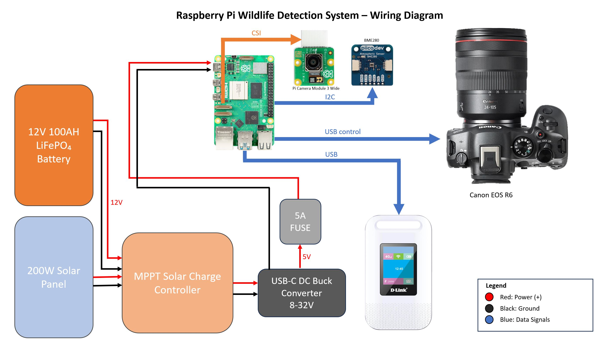

# Wildlife Camera System

A full-stack, remote wildlife detection and monitoring system. Streams live HLS video, transmits temperature/pressure/humidity data, and can capture high-resolution still images from a Canon EOS R6 — either on motion detection or manual remote trigger. Designed to operate anywhere with Telstra mobile coverage; future upgrades such as Starlink internet would make it deployable anywhere on Earth.

Built with a Raspberry Pi 5, an AWS EC2 backend, and a React-based frontend dashboard.

Watch the Video Below!

## Demo Video

[](https://youtu.be/tZjDdPRHNxE)

[▶ **Watch the demo video on YouTube**](https://youtu.be/tZjDdPRHNxE)

_Click the image or the "▶ Play video" button to watch it._

## 

## 

I am an engineer with passion for embedded systems and photography. I wanted to make this project to demonstrate my skills and create something I can use for photography projects which can be used anywhere in the world to capture hard to reach places, scenes or wildlife. You can use the system to research behavioural and location analysis of wildlife and correlate that data against environmental parameters like: temperaure, pressure and humidity. What's more you don't have to wait to retrieve the results you can access them instantly online and don't have to trek back into the wild to pickup any gear.

In future the motion detection algorithm can be remotely updated and the potential is there to train an AI model to more specifically detect wildlife or events of interest.

---

## Features

- Remote still photgraph capture with Canon EOS R6
- Toggleable modes: motion detection - live stream
- Sensor telemetry: temperature, pressure, humidity
- AWS-hosted backend
- Frontend dashboard built in React: live video stream player, data charts, and camera control

---

## Project Structure

```
├── captures/                     # Optional saved test images or videos
│
├── docs/                          # Build images and final deployed photograph
│   ├── Pi-Wildlife-Detection-System-Wiring-Diagram.JPG
│   └── build-images/
│       ├── 1.jpg … 40.jpg
│       ├── AlFlange.JPG
│       └── Deployed.JPG
│
├── ec2-server/                    # Backend scripts and dockerfile for video stream and sensor data
│   ├── environmental_sensor/      # Flask API for sending BMP280 sensor data to the EC2 server
│   │   ├── app.py
│   │   ├── Dockerfile.txt
│   │   └── requirements.txt
│   │
│   └── nginx-rtmp/                 # RTMP/HLS server
│       ├── docker-compose.yml
│       ├── nginx.conf
│       └── nginx-hls/
│
├── frontend/                      # Front End React Website
│   └── react-frontend/
│       ├── player.html
│       ├── styles.css
│       └── pi-stream-ui/
│           ├── .env.example
│           ├── package.json
│           ├── public/
│           └── src/
│
├── hardware/                      # CAD/drawings for custom lens port for Canon R6
│   ├── acrylic-flange-files/
│   ├── aluminium-flange-files/
│   └── pmma-flange-files/
│
└── pi/                            # All scripts that run on the Pi for the different functions
    ├── capture_api.py              # Remote still photo capture with the Canon EOS R6
    ├── motion_trigger_picamera2.py # Motion detection script that triggers the R6
    ├── send_sensor_data.py         # Sends sensor data to the EC2 backend
    ├── start_stream.sh             # Used whenever the user switches into streaming mode
    └── requirements.txt
```

---

## Hardware

- Raspberry Pi 5 8GB
- Pi Camera Module 3 Wide
- Canon EOS R6 with 24–70mm f2.8 RF lens
- Picodev BME280 environmental sensor
- D-Link Cat6 Mobile Hotspot
- Kings 12V LiFePO4 battery
- Kings 200W Solar Panel
- Kings Anderson Solar Extension Cable
- Dune MPPT Solar Charge Controller
- Tactix Black Extra Large Tough Case
- Custom camera lens port (see `/hardware/`)
- 2 × 6mm Waterproof cable glands

---

## Software

- Raspberry Pi OS (Bookworm or later, 64-bit)
- Python 3.11+
- `libcamera`
- `gphoto2`
- `ffmpeg`
- AWS EC2 backend (NGINX RTMP/HLS + Flask API)

---

## Installation

1. **Clone this repository** onto your Pi 5:

   ```bash
   git clone https://github.com/Adrian-Amoddio/wildlife-detection-camera-system.git
   cd wildlife-detection-camera-system/pi
   ```

2. **Install Python dependencies**:

   ```bash
   python3 -m venv venv
   source venv/bin/activate
   pip install -r requirements.txt
   ```

3. **Install system dependencies**:

   ```bash
   sudo apt update
   sudo apt install ffmpeg gphoto2 python3-pip libatlas-base-dev
   ```

4. **Configure environmental sensor**:

   - Ensure the BME280 is connected via I²C
   - Enable I2C on the Pi:
     ```bash
     sudo raspi-config
     # Interfacing Options - I2C - Enable
     ```
   - Verify it’s detected:
     ```bash
     sudo apt install -y i2c-tools
     i2cdetect -y 1
     ```

5. **Set environment variables** (optional):
   - Create a `.env` file:
     ```bash
     SENSOR_API_URL=https://<ec2-server-ip>/sensor
     RTMP_SERVER_URL=rtmp://<ec2-server-ip>/live/stream
     ```

---

## Scripts Overview

- **capture_api.py** – Flask API to trigger still capture from the Canon EOS R6. Then return and save the image.
- **motion_trigger_picamera2.py** – Uses Pi Camera Module 3 Wide for motion detection to trigger R6 still capture or switch to streaming.
- **send_sensor_data.py** – Reads temperature, pressure, and humidity from BME280 and sends JSON to EC2 backend every 10 seconds.
- **start_stream.sh** – Launches live streaming pipeline and sends to EC2 instance.

---

## Usage

### Start live stream

```bash
chmod +x start_stream.sh
./start_stream.sh
```

### Run environmental sensor loop

```bash
python3 send_sensor_data.py
```

### Run motion detection

```bash
python3 motion_trigger_picamera2.py
```

### Start capture API server

```bash
python3 capture_api.py
```

Trigger remote capture:

```bash
curl -X POST http://<pi-ip>:5000/capture
```

---

## Recommended Deployment

The scripts below need to be run on boot if you want the system to operate independantly. It is recommended you do this as running anything manually in remote areas is difficult.

- `capture_api.py`
- `send_sensor_data.py`

---

## Notes

- The motion detection and video screaming scripts cannot run simultanously. One one can run at a time other wise this will cause an error or the pi will crash
- Canon EOS R6 must be powered on and connect with a USB to the Pi
- Ensure the EC2 instance is running before running any scripts on the pi or trying to access the front end.

---

## Setup References

- [Raspberry Pi scripts](pi/README.md)
- [EC2 backend](ec2-server/README.md)
- [Frontend UI](frontend/react-frontend/pi-stream-ui/README.md)

---

## License

MIT License — free to use, modify, and distribute.
